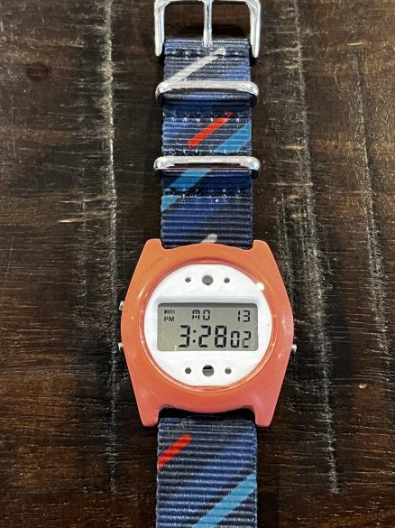

# Cron91

This is a Casio f91w "Total Conversion". It uses the module, back, gasket, and buttons from a Casio f91w to create a wholly new watch. 

## Build List

- [F91W Watch](https://amzn.to/3yCgZ22). This can be found from $10-$20. This link might not be the cheapest listing. 
- [28.5mm diameter, 1.5mm thick Watch Crystal](https://amzn.to/3JBo8WB). This link is to an 8-pack of these crystals.
- [m1.4 or m1.7 self tapping screws](https://amzn.to/3mO5Mce). This link is for an assortment of screws. Machine screws will also work.
- [GS Hypo Cement](https://amzn.to/3JBtjpH). This is optional but secures the crystal and waterproofs the watch a little more.
- 20 mm watch strap of your choice. I like NATO style straps for the cron91. 

## Instructions

- Print a body and dial. Or, print the body and laser cut the dial. 
- (Optionally) sand and finish the case and dial.
- Pop a 28.5 mm, 1.5 mm thick watch crystal into the body. 
- (Optionally) place a thin bead of GS Hypo cement along the lip that supports the crystal and pop the crystal in. Use rubbing alcohol to remove excess. 
- Remove the back of the f91w.
- Pull out the module and the gasket.
- Use something poky to push out the buttons. 
- Place the dial into the body against the crystal (once the glue is dry). 
- Place the module into the body.
- Place the gasket on the back of the 3d-printed module. 
- Screw the back onto the 3d-printed body using self-tapping screws.
- Press the buttons into the 3d-printed body. 
- Attach a 20 mm strap to the lugs using spring bars. 
